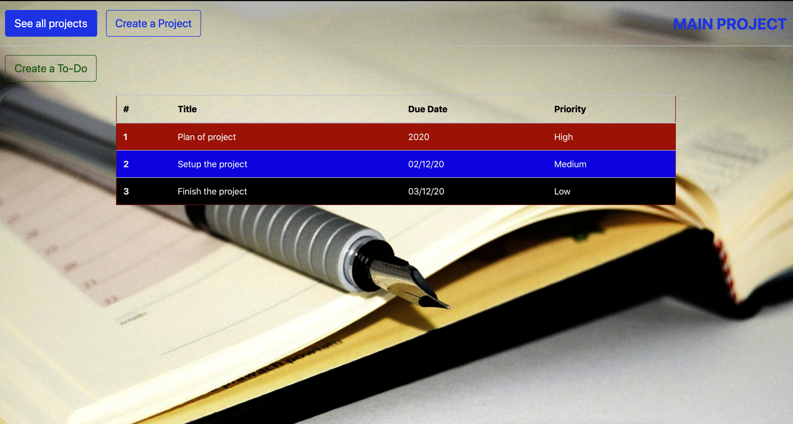
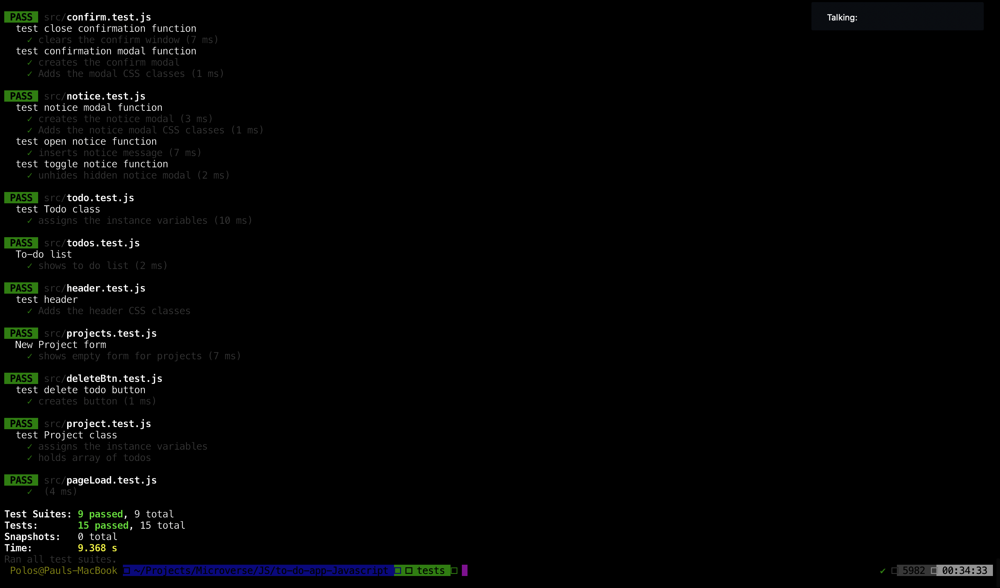

# To-Do-App-Javascript

> This is a single page application for a to-do list.

All page information dynamically generated and component loading achieved using pure Javascript. Persistence is with local storage

## Built With

- HTML5,
- CSS3,
- Bootstrap,
- Javascript,
- Webpack

## Live Demo

[Live Demo Link](https://raw.githack.com/pbkabali/to-do-app-Javascript/app-build/dist/index.html)

## Getting Started

To get a local copy up and running in development mode, follow these simple steps.

### Prerequisites

- Node.js
- Browser
- Terminal

### Setup

Clone the project from [here](https://github.com/pbkabali/to-do-app-Javascript)

### Install

Run `npm install` to get all the dependencies.

Run `npm run build` for one time build of bundle after changes.

Run `npm run watch` to run webpack build in watch mode.

### Tests

Run `npm test` from the root directory to run tests and output the result in the terminal as below.

### Usage

Open `./dist/index.html` in your browser

## Authors

👤 **Paul Balitema Kabali**

- Github: [@pbkabali](https://github.com/pbkabali)
- Twitter: [@pbkabali](https://twitter.com/pbkabali)
- Linkedin: [engineerbpk](https://linkedin.com/in/engineerbpk)

👤 **Oksana Petrova**

- Github:[@Laguna1](https://github.com/Laguna1)
- Linkedin: [Oksana Petrova](https://www.linkedin.com/in/oksana-petrova-005bb0145/)
- Twitter: [Oksana Petrova](https://twitter.com/OksanaP48303303)

## 🤝 Contributing

Contributions, issues and feature requests are welcome!

Feel free to check the [issues page](https://github.com/pbkabali/to-do-app-Javascript/issues).

## Show your support

Give a ⭐️ if you like this project!

## Acknowledgments

- [The Odin Project](https://www.theodinproject.com/)

## 📝 License

This project is [MIT](https://opensource.org/licenses/MIT) licensed.
